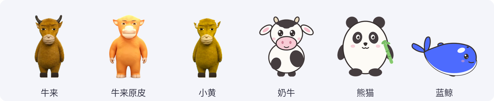
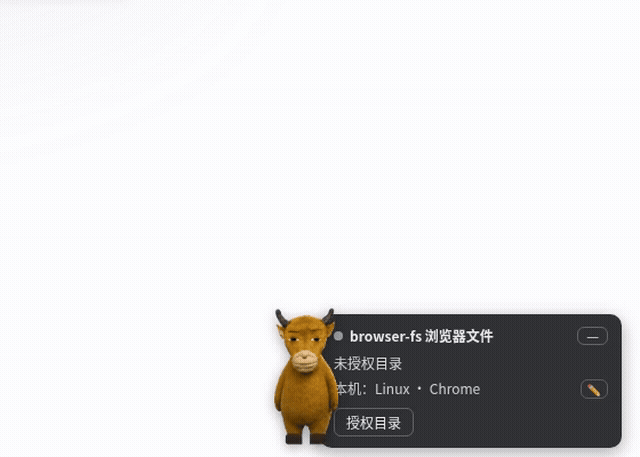

# dsh-niulai-pet

**中文** | [English](README_EN.md)

牛来桌宠 —— 在 dsh web 界面角落里养一头《牛来》的小牛。平时呼吸、眨眼、踱步、
打盹、气泡唠叨；agent 任务一完成，它就蹦出来喊一声「妈~~妈~~」。

全部能力在浏览器端（client 半）；host 半是空插件（`index.js`），仅为官方 CLI
安装识别（`dsh.bundle` manifest）。**更新后刷新页面即生效，免重启**。

**[在线试玩（免安装）](https://whitefirer.org/niulai-pet/)** —— 同一套代码的
standalone 页面，模拟任务驱动庆祝；想真养在 dsh 里再往下看安装。





## 皮肤

| 皮肤 | 素材 | 叫声 | 签名动作 |
|---|---|---|---|
| 牛来 | 抠图 + PIL 精修 | 原声（已降噪） | 连跳 |
| 牛来原皮 | AI 生图三视图抠图（无角幼年造型） | 同上 | 连跳 |
| 小黄 | 牛来幼年皮（去角+黄亮） | 同上 | 翻滚 |
| 奶牛 | 手绘扁平风（SVG 源在 tools/drawn/） | WebAudio 合成"哞" | 翻滚 |
| 熊猫 | 手绘 | 合成吱声 | 翻滚 |
| 蓝鲸 | 手绘（DeepSeek 蓝 + 虎鲸眼斑） | 合成鲸鸣 | 跃出水面（弧顶喷水） |

## 行为

| 交互 | 反应 |
|---|---|
| 待着不动 | 呼吸浮动；随机眨眼 / 小跳 / 踱步 / 趴下打盹 / 扭身子；偶尔气泡吐槽 |
| AI 会话在跑 | 气泡报时「AI 已经跑了 X分X秒…」 |
| 点击（戳） | 喊一声（只张合嘴不跳的是菜单里的「喊一声」）+ 绑定动作 |
| 拖拽 | 拎着走，松手落地回弹；位置记忆（localStorage） |
| 右键 | 菜单：声音 / 完成时喊 / 气泡唠叨（胶囊开关）+ 完成连喊 1-3 声 /<br>完成时动作 / 戳我动作 / 皮肤（循环项）+ 飞一圈 / 喊一声 / 关于 |
| 任务完成 | 喊声（可连喊）+ 气泡 + 嘴型开-合-开保持到尾音结束 + 绑定动作（6s 节流） |

动作库：飞行（向上抛物线）/ 摇摆舞 / 转圈 / 连跳 / 翻滚 / 跃出水面 / 奶牛摇，
任意皮肤可绑任意动作，「签名动作」= 跟随当前皮肤，「随机」= 现场抽。

任务完成信号来自 client runtime 的 `sessions.list` 快照订阅：
`running true→false`（当前会话跑完）或 `completed` 新置位（后台会话完成）。
宿主太旧没有 sessions 服务时降级为仅手动交互。

## 安装

```sh
dsh plugin --profile web add github:whitefirer/dsh-niulai-pet
```

`lib/` 构建产物已入库，安装零脚本；首次安装重启一次 dsh web，之后升级刷新页面即可。

## 素材说明

**素材全部入库，开箱即装即玩。** 奶牛/熊猫/蓝鲸为手绘原创
（SVG 源文件在 `tools/drawn/`），可自由取用。

想换形象/声音：覆盖 `assets/` 里的文件后 `npm run build`，刷新页面即生效。
重建全部素材的管线脚本在 `tools/`（见 AGENTS.md）。

## 开发

```sh
npm install
npm run build      # 产物 lib/client.js（CJS 闭包 + __ModuleLoader__ 包装）
npm run typecheck
```

装进 profile 调试：

```sh
cd ~/.dsh/profiles/web && pnpm add file:/path/to/dsh-niulai-pet
# 首次安装重启一次 dsh web（市场 shim 在宿主启动时挂载）；之后改代码只需
# npm run build + 刷新页面
```

页面 URL 加 `?petdebug=1` 会在 `window.__niulai` 暴露桌宠句柄
（celebrate/poke/setBusy/destroy），playwright 验证脚本靠它驱动。

## 实现要点（给后来的维护者）

- `ctx.effect` 的回调是**立即执行**的，清理函数要再包一层返回
  （`ctx.effect(() => () => cleanup())`）——写错会在 apply 时直接把桌宠销毁。
- dsh 首屏 React 挂载会置换 `document.body` 的直挂节点：插件用
  MutationObserver 守灵，被清就自动重挂。
- 朝向翻转放在根节点 `scaleX`，气泡/菜单用 `scaleX(var(--face))` 抵消，
  否则文字会镜像。
- 更完整的状态机、素材管线与坑清单见 [AGENTS.md](AGENTS.md)。
