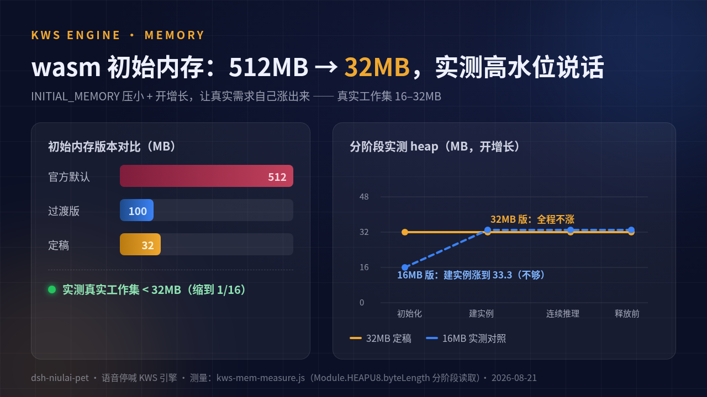
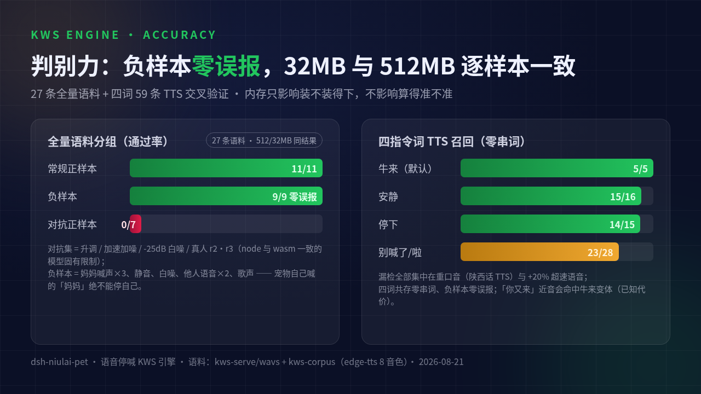

# 语音停喊引擎：演进、架构与实测数据

> 2026-08-21 沉淀。一句话：循环喊期间喊一声指令词（默认「牛来」）即停——
> 从零模型模板匹配起步，四代演进到 sherpa-onnx KWS 模型 + Web Worker 架构。
> 本文是所有数据结论的单一来源：内存实测、判别力语料、多关键词交叉验证、
> 音频降噪。构建/冒烟复跑细节见 `../AGENTS.md` 与 wasm-build 的 BUILD-NOTES.md。

## 一、四代演进（2026-08-21 一天内）

| 代 | 引擎 | 判别力 | 内存/加载 | 问题 |
|---|---|---|---|---|
| v1 | 零模型模板匹配（MFCC 39维 + 子序列 DTW + 谱减 + 双端 CMN） | 正 ≤0.43 < 阈值 0.54 < 负 ≥0.66（连续 3 次过阈防抖） | 零下载零模型 | 他人嗓音对不上电影模板是固有上限（→ 自录模板兜底） |
| v2 | sherpa-onnx KWS（zipformer wenetspeech-3.3M int8）wasm，主线程 | 同 node int8 逐样本一致 | 17MB 同源加载，INITIAL_MEMORY=512MB | 内存圈地太大 |
| v3 | + 指令词可配（4 词多选）+ 真实识别测试界面 | 四词零串词零误报 | 同上 | 配置与调试补齐 |
| v4（现） | **Web Worker 化**：空闲 10s terminate 真释放 | 与 v2 逐样本一致 | **INITIAL_MEMORY 实测定稿 32MB**，只听时段占用 | — |

为什么 template 引擎还留着：零下载零模型的轻量路径，KWS 装载失败自动回落它
（老 dsh 无 webServer、worker 被拦等场景）。

## 二、当前架构（v4）

```
主线程                                Web Worker（kws-worker.js）
─────                                 ─────────────────────────
pet.ts / 卡片测试
  └ createKwsMatcher(关键词, onHit)
      │ postMessage {init}    ──►   importScripts(loader+glue)
      │                            createKws（模型驻留 worker 堆）
      │ {open, id}            ──►   createStream
      │ {feed, id, samples}   ──►   acceptWaveform→decode
      │   (buffer transfer 零拷贝)         │
      │                        ◄──  {hit, id, keyword}
      │ {close, id}           ──►   reset+free stream
      ▼
  引用计数归零 + 空闲 10s
      └ worker.terminate()  ──►   整个 wasm 实例被 GC，内存真归还
```

关键事实：

- **wasm 线性内存只涨不缩**——`kws.free()` 只把 C++ 对象还给 wasm 堆，
  物理内存不归还浏览器；`worker.terminate()` 是唯一可证明的释放路径。
- 重建成本低：wasm 编译缓存（按 URL）+ HTTP 缓存，worker 重建实测 1.4–1.9s
  （含 wasm 编译 + 4.8MB 模型装载 + 建实例）。
- 加载时机：**插件运行不加载、开开关不加载，真正开听（循环喊布防/卡片测试）
  才加载**；不听时零 wasm 开销。
- stream id 多路复用：卡片测试与正式监听可共存于同一 worker。

## 三、内存实测（INITIAL_MEMORY 定稿依据）

测量方法：`INITIAL_MEMORY` 压小 + `ALLOW_MEMORY_GROWTH=1`，让真实需求自己
涨出来；逐阶段读 `Module.HEAPU8.byteLength`
（脚本 `/home/tenbox/resize-diag/kws-mem-measure.js`）。

| 初始内存 | 运行时初始化 | createKws（4 词 10 变体） | 推理（0.9s/3.5s/6.2s 连续） | 结论 |
|---|---|---|---|---|
| 512MB（官方默认） | 512 | 512 | 512 | 圈地闲置 ~16× |
| 16MB | 16.0 | **涨到 33.3** | 33.3（平） | 不够 |
| **32MB（定稿）** | 32.0 | 32.0（不涨） | 32.0（不涨） | **真实工作集 <32MB** |



结论：**真实工作集在 16–32MB 之间，INITIAL_MEMORY=32MB 全程零增长**
（增长有拷贝停顿，初始即高水位最稳）；`ALLOW_MEMORY_GROWTH` 留作安全网。
内存参数只影响"装不装得下"，不影响模型数学——见下节准确度逐样本一致。

性能参考：int8 推理 rtf ≈ 0.03（0.91s 音频 ~25–40ms，6.2s 音频 ~200–440ms，
单线程 worker 内）；worker 重建（缓存后）1.4–1.9s。

## 四、判别力数据



### 4.1 KWS 全量语料（27 条，512MB 版与 32MB 版逐样本一致）

| 分组 | 通过 | 说明 |
|---|---|---|
| 常规正样本（牛来本体+变调/变速/窄带扰动+真人录音 r1） | 11/11 | reply/band/match/pitchdn/ref/tempodn/tempoup、x-r1、x-niulai、x-cmp_theirs 等 |
| 对抗正样本（升调/加速加噪/-25dB 白噪/真人 r2/r3） | 0/7 | **已知限制**：reply-noise、reply-pitchup、reply-tempo-noise、x-r2/r3、x-reply_r2/r3 |
| 负样本（妈妈喊声×3、静音、白噪、他人语音×2、歌声） | **9/9 零误报** | 宠物自己喊的「妈妈」绝不能停自己，这是功能杀手 |

→ 20/27，失败集 = 7 条对抗样本，与 node int8 完全一致。
（浏览器复跑：`SMOKE_URL=.../full.html node kws-smoke.js`）

### 4.2 多关键词交叉验证（四词共存，59 条 TTS 语料 + 上表负样本）

| 指令词 | 音素变体行数 | TTS 召回 | 串词 | 漏检集中在 |
|---|---|---|---|---|
| 牛来（默认） | 4 | 5/5（既有语料） | 0 | — |
| 别喊了 | 2 | 12/14 | 0 | 陕西口音×2、+20% 语速×1 |
| 别喊啦（同预设） | — | 11/14 | 0 | 陕西口音×2、+20% 语速×1 |
| 安静 | 2 | 15/16 | 0 | +20% 语速×1 |
| 停下 | 2 | 14/15 | 0 | +20% 语速×1 |
| 负样本（同上 9 条） | — | **零误报** | — | — |

- 串词 = 喊 A 词命中 B 词：四词任意组合下为零。
- 漏检全部是重口音/超速语音；试过加声调/鼻音变体猜修**无效**（不堆变体，
  只涨误报风险）——用户换个自己喊着顺的词即可。
- 已知近音误触发：「你又来」会命中牛来变体（音素变体的固有代价）。
- 脚本：`/tmp/niulai-stt/kws-multi-test.js`（语料：`kws-corpus/` edge-tts 8 音色×2 语速）。

### 4.3 模板引擎（v1，保留作轻量路径与回落）

| 指标 | 值 |
|---|---|
| 特征 | 13 维 MFCC + Δ + ΔΔ = 39 维，双端 CMN，谱减（逐 mel bin 底噪 EMA） |
| 匹配 | 子序列 DTW（余弦代价 + 非对角步惩罚 1.2），多模板取 min |
| 判定 | 正样本最高 ≈0.43 < **阈值 0.54（可配 0.30–0.85）** < 负样本最低 ≈0.66，连续 **3** 次过阈才命中 |
| 已知限制 | 他人嗓音对不上电影模板；**自录模板**（卡片内录 1.9s）是终极解法（本人嗓音几乎必中） |
| 标定 | `test/voice-matcher.mts`（node 直跑，ALL PASS 才能合入） |

## 五、回应音（妈妈那句「牛来！」）处理数据

自截电影片段（BV1wBbC6MEDU 12.45s 段）三级处理：

| 阶段 | 处理 | 底噪 |
|---|---|---|
| 原始截取 | — | -30dB |
| 一级降噪 | afftdn + anlmdn | -44dB |
| 二级 | 190Hz 双级高通去隆隆声 + 噪声门压沉默段 | **-78dB** |
| 尾切 | 切掉结尾半个「嗯」（0.66s 紧凑版）+ 衰减尾早切 | 尾段低频残留 66%→0.7% |

## 六、指令词预设表（kws.ts `KWS_KEYWORD_PRESETS`）

| id | 词 | sherpa keywords 行（音素 @词，变体 @词+字母） |
|---|---|---|
| niulai（默认选词） | 牛来 | `n iú l ái @牛来` + `n ǐ y òu l ái @牛来A` / `n ǐ y ǒu l ái @牛来B` / `n iú y òu l ái @牛来C` |
| biehanle | 别喊了 | `b ié h ǎn l e @别喊了` + `b ié h ǎn l a @别喊了A` |
| anjing | 安静 | `ān j ìng @安静` + `ān j īng @安静A` |
| tingxia | 停下 | `t íng x ià @停下` + `t íng x iā @停下A` |

KWS 参数：`keywordsThreshold 0.1 / keywordsScore 1.5`（node 侧语料标定）。
加新词 = 表里加一条 + 重跑 §4.2 交叉验证（零串词零误报才收）。
配置默认 `['niulai']`（schema 默认、清洗回落、至少留一个三重保证）。

## 七、已知限制汇总

1. 重口音（陕西话级）/ +20% 超速语音会漏检（四词同患，不堆变体）。
2. 「你又来」近音误触发牛来（变体代价）。
3. 对抗扰动（升调/加速加噪/极端白噪）漏检 7/27（node/wasm 一致，模型固有）。
4. INITIAL_MEMORY=32MB 装不下时会增长（拷贝停顿）；涨不动则装载失败 →
   自动回落模板引擎。
5. 真机麦克风召回受设备/距离影响；模板引擎另有自录模板兜底。

## 八、复跑清单

| 内容 | 脚本 |
|---|---|
| wasm 构建（可复现） | `/home/tenbox/wasm-build/BUILD-NOTES.md` |
| 浏览器冒烟（2 条快检 / 27 条全量） | `dist-kws` + `node /home/tenbox/resize-diag/kws-smoke.js`（SMOKE_URL 切换） |
| worker 全链路（真实 dsh 页面） | `node /home/tenbox/resize-diag/kws-e2e-worker.js` |
| 内存实测 | `node /home/tenbox/resize-diag/kws-mem-measure.js` |
| 多关键词交叉验证 | `node /tmp/niulai-stt/kws-multi-test.js` |
| 模板引擎离线标定 | `node --experimental-strip-types test/voice-matcher.mts` |
| 卡片 UI（引擎/关键词/测试界面/空闲 terminate） | `/tmp/niulai/smoke-kws-card2.mjs`、`smoke-kws-teardown.mjs` |
| 延迟庆祝判死 | `/tmp/niulai/smoke-delay-cancel.mjs`（demo 页） |
